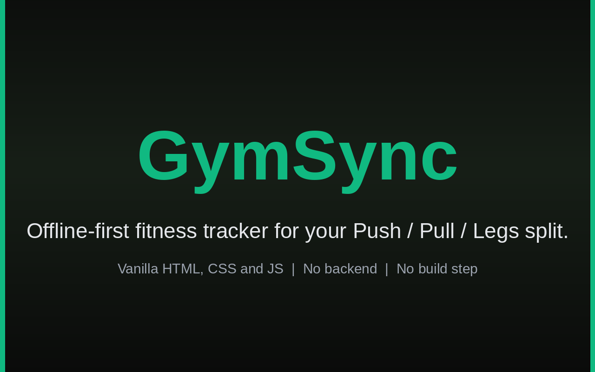

# GymSync




> GymSync is an offline-first fitness tracker that lives entirely in your browser, giving you a daily Push/Pull/Legs workout dashboard with live logging, streaks and history, with no account, no backend and no network calls.

 

## About

**What.** GymSync is an offline-first fitness tracker that lives entirely in your browser. It gives you a personalized dashboard with your daily Push / Pull / Legs split, a live workout screen with an elapsed timer and per-exercise weight and notes logging, persisted stats like workout streak and weekly completion, and a full history log of every completed session. There is no account, no backend, and no network call: your data stays on your device in Local Storage.

**Why.** GymSync is a long-term software engineering project built throughout a Bachelor of Computer Applications (BCA). Instead of creating dozens of disconnected tutorial projects, the idea was to continuously improve one real application while learning modern software engineering, with every phase adding features, cleaner architecture and better coding practices.

**When.** September 2026.

## Tech Stack

  

- HTML5
- CSS3
- Vanilla JavaScript (ES6)
- Local Storage API

**Why this stack**

- **Vanilla JavaScript, no frameworks or build step:** the app runs by simply opening `index.html` in a browser, and ES6 modules were enough for the resolver, timer and storage logic.
- **Plain CSS3:** hand-written styles keep full control over the Apple-inspired dark theme, glassmorphism cards and mobile-first responsive layout without pulling in a framework.
- **Local Storage API:** the app is designed to be offline-first and account-free, so browser storage covers the user profile, workout log and stats with zero backend cost.
- **GitHub Pages:** static hosting fits a project with no build step and no server.

## How It Works

- On first launch an onboarding screen collects your name and saves it to Local Storage; returning users skip it automatically.
- A single resolver, `getTodaysWorkout()`, maps the current weekday to a split (Push / Pull / Legs / Rest) and returns that day's exercise list from an in-app exercise database, so the dashboard, workout screen and history all share one source of truth.
- The dashboard renders the greeting, live clock, today's split and live stats (streak, weekly completion, last workout).
- Opening a training day starts a live elapsed timer; each exercise card logs weight, notes and a completed checkbox, with a progress bar tracking completion.
- Finishing saves the session to the history log and updates the streak (once per calendar day), weekly completion (resets each Monday) and last-workout stats.
- The History tab lists every past session newest first, each expandable to show logged weights and notes.

## Features

- **Onboarding:** welcome screen collects your name and saves it to Local Storage; returning users skip onboarding automatically.
- **Dashboard:** personalized greeting, live digital clock, current day and date, today's workout split, motivational quotes and a Start Workout button.
- **Stats that persist:** workout streak, weekly completion and last workout saved to Local Storage, so the dashboard stats are no longer placeholders. The streak advances once per calendar day and resets if a training day is missed; weekly completion resets automatically each Monday.
- **Workout logic engine:** `getTodaysWorkout()` maps the weekday to Push / Pull / Legs / Rest and returns each split's exercise list, with target sets and rep ranges for every movement from an in-app database. One source of truth feeds the dashboard, workout screen and history, and the dashboard shows live counts like "5 exercises scheduled" instead of a static label.
- **Workout screen:** live elapsed timer starting the moment a training day's workout opens, exercise cards rendered from the workout logic engine, per-exercise weight and notes input, custom accessible completed checkboxes, a live progress bar, a Finish Workout flow and a dedicated Rest Day state on days with nothing scheduled.
- **Workout summary:** congratulations screen after Finish Workout showing workout duration, exercises completed and estimated calories burned.
- **History:** full workout history log, newest first, every past entry expandable to show each exercise's logged weight and notes, with total workouts and current streak shown at a glance and an honest empty state until the first workout is finished.
- **Navigation:** responsive sidebar on desktop, bottom navigation on mobile, animated active indicator and smooth page transitions.
- **User interface:** Apple-inspired design with dark mode, glassmorphism, mobile-first responsive layout and smooth animations. Emerald Green plus Black theme, subtle hover lift on cards for desktop, and micro-interactions that only fire on real updates (checkboxes pop, dashboard stats pulse). Mobile polish includes the iOS Safari input-zoom fix, removed tap delay and double-tap zoom, and contained overscroll so the page no longer rubber-bands.
- **Offline by design:** no account, no backend, no network calls. The user profile, workout log and stats live in Local Storage on your device.

## Workout Split

| Day | Workout | Exercises |
|------|----------|----------|
| Monday | Push | 5 |
| Tuesday | Pull | 5 |
| Wednesday | Legs | 5 |
| Thursday | Push | 5 |
| Friday | Pull | 5 |
| Saturday | Legs | 5 |
| Sunday | Recovery | - |

## Screenshots


## Project Structure

```text
GymSync/
|
|-- assets/
|   |-- logo.svg
|   |-- images/
|   `-- screenshots/
|
|-- docs/
|   |-- CHANGELOG.md
|   |-- LEARNING.md
|   `-- WHY.md
|
|-- index.html
|-- style.css
|-- script.js
|
|-- README.md
|-- LICENSE
`-- .gitignore
```

## Quick Start

### Prerequisites

- A modern web browser (Chrome, Edge, Firefox or Safari).
- No build tools, dependencies, accounts or installs required.

### Installation

1. Clone the repository:

```bash
git clone https://github.com/p3xz/gymsyncs.git
```

2. Enter the project folder:

```bash
cd gymsyncs
```

3. Run it. The simplest way is to open `index.html` in your browser, or serve the folder with VS Code Live Server. There is no build step and nothing to install.

## Usage

Serve the folder and open it in your browser:

```bash
python3 -m http.server 8000
```

Then visit `http://localhost:8000` to use GymSync.

## Development Progress

- **Phase 1:** Project setup, responsive layout, dark theme, navigation system.
- **Phase 2:** First-launch onboarding, user profile setup, Local Storage integration.
- **Phase 3:** Personalized dashboard, live clock, current day and date, workout split, dashboard statistics, motivational quotes, improved UI, responsive navigation.
- **Phase 4:** Automatic workout split resolution engine, per-split exercise database with sets and rep targets, single `getTodaysWorkout()` source of truth, dashboard shows live exercise counts.
- **Phase 5:** Live workout timer, exercise cards with weight and notes input, completed checkbox per exercise, live progress bar, Finish Workout flow, Rest Day state on the Workout tab.
- **Phase 6:** Congratulations and summary screen with duration, exercises completed and calories burned. Streak, weekly completion and last workout now persist to Local Storage, so the dashboard stats reflect actual saved progress.
- **Phase 7:** Full workout history log, expandable entries showing per-exercise weight and notes, total workouts and streak summary, empty state for new users.
- **Phase 8 (current):** Fixed the iOS input-zoom bug on the workout screen, removed tap delay and double-tap zoom app-wide, contained overscroll and rubber-banding on mobile, checkbox pop plus stat pulse micro-interactions, desktop card hover lift, Emerald Green and Black theme.

### v1.0 Complete

All 8 planned phases are done. GymSync now covers onboarding, a live dashboard, automatic workout logic, a full workout-logging screen, persisted stats, workout history and a mobile-optimized polish pass, entirely offline, with no framework or backend.

## Roadmap

Future releases:

- React
- Backend
- Authentication
- Cloud Sync
- Mobile App
- Nutrition Tracking
- AI Workout Coach
- Smart Analytics

## Contributing

This is currently a personal learning project.
Suggestions, feature requests and feedback are always welcome.

## License

This project is licensed under the MIT License. See the `LICENSE` file for details.

## Credits

**Namish Yadav**

- GitHub: https://github.com/p3xz
- LinkedIn: https://www.linkedin.com/in/namish-yadav-639769408/
- Instagram: https://instagram.com/nam7sh

## If you like GymSync, consider giving the repository a Star!

**Built with HTML, CSS and vanilla JavaScript.**
